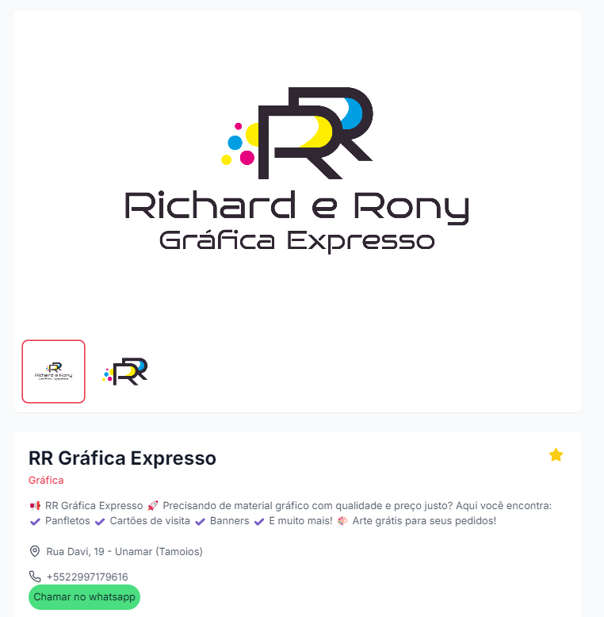

# Projeto Central Unamar

## Visão Geral

O **Central Unamar** é uma plataforma de comércios e notícias que tem como objetivo promover os negócios locais da região de Unamar. O projeto foi criado para permitir que os comerciantes da região possam divulgar seus produtos e serviços, oferecendo visibilidade por meio de planos de assinatura. Além disso, a plataforma contém um portal de notícias locais, permitindo que jornalistas da região publiquem conteúdo relevante para a comunidade.

 <!-- Coloque o link da imagem do logo aqui -->

---

## Funcionalidades

### 1. **Comércios em Destaque**
Comerciantes podem escolher um plano de assinatura para destacar seus negócios na plataforma, aumentando a visibilidade e a chance de atrair mais clientes.

- **Plano Básico**: Destaque simples no site.
- **Plano Intermediário**: Maior visibilidade e destaque em seções específicas.
- **Plano Premium**: Aparecimento no carrossel principal e maior destaque no site.

#### Exemplo de Página de Comércios:
 <!-- Coloque o link do print da página de comércios -->

### 2. **Notícias Locais**
O portal de notícias oferece informações relevantes sobre a região, incluindo tópicos como segurança pública, economia, clima, e eventos culturais.

#### Exemplo de Página de Notícias:
 <!-- Coloque o link do print da página de notícias -->

### 3. **Busca Avançada de Comércios**
A plataforma possui uma barra de busca avançada para que os usuários encontrem os comércios de acordo com categorias, localização, ou palavras-chave.

#### Exemplo de Barra de Busca:
 <!-- Coloque o link do print da barra de busca -->

<!-- ### 4. **Sistema de Avaliação**
Usuários podem avaliar os comércios com uma nota de 0 a 5, oferecendo feedback para os negócios e ajudando novos clientes a tomar decisões.

#### Exemplo de Avaliação:
 Coloque o link do print da avaliação -->

---

## Tecnologias Utilizadas

O projeto foi desenvolvido utilizando as seguintes tecnologias:

- **Frontend**:
  - React
  - Tailwind CSS
  - ShadCN UI
  - React Router
  - React Helmet (SEO)

- **Backend**:
  - Supabase (Autenticação, Banco de Dados)

<!-- - **Outros**:
  - Firebase para o envio de notificações
  - Figma para o design da interface -->

---

## Como Usar

### 1. **Cadastro de Comerciantes**
- O comerciante se cadastra na plataforma e escolhe o plano de assinatura.
- Após o cadastro, o comerciante pode adicionar suas informações, fotos, e detalhes de contato.

#### Exemplo de Cadastro:
 <!-- Coloque o link do print do cadastro -->

### 2. **Publicação de Notícias**
- Jornalistas ou administradores podem criar, editar e excluir notícias na plataforma, incluindo título, imagem, categoria e conteúdo.
<!-- 
#### Exemplo de Publicação de Notícias:
 Coloque o link do print da publicação de notícias -->

---

## Contato

Se você tiver dúvidas ou sugestões, entre em contato conosco!

- **Email**: richardfelipelives@gmail.com

